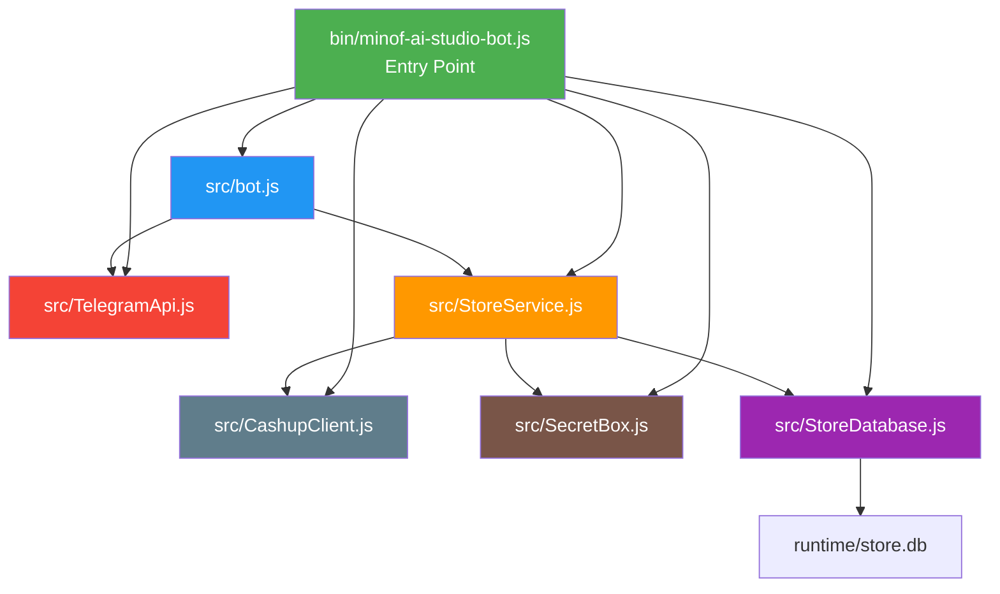
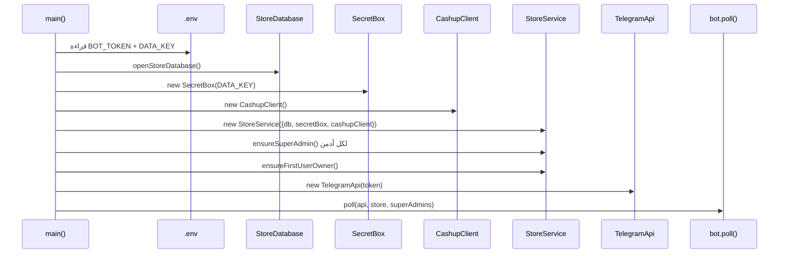
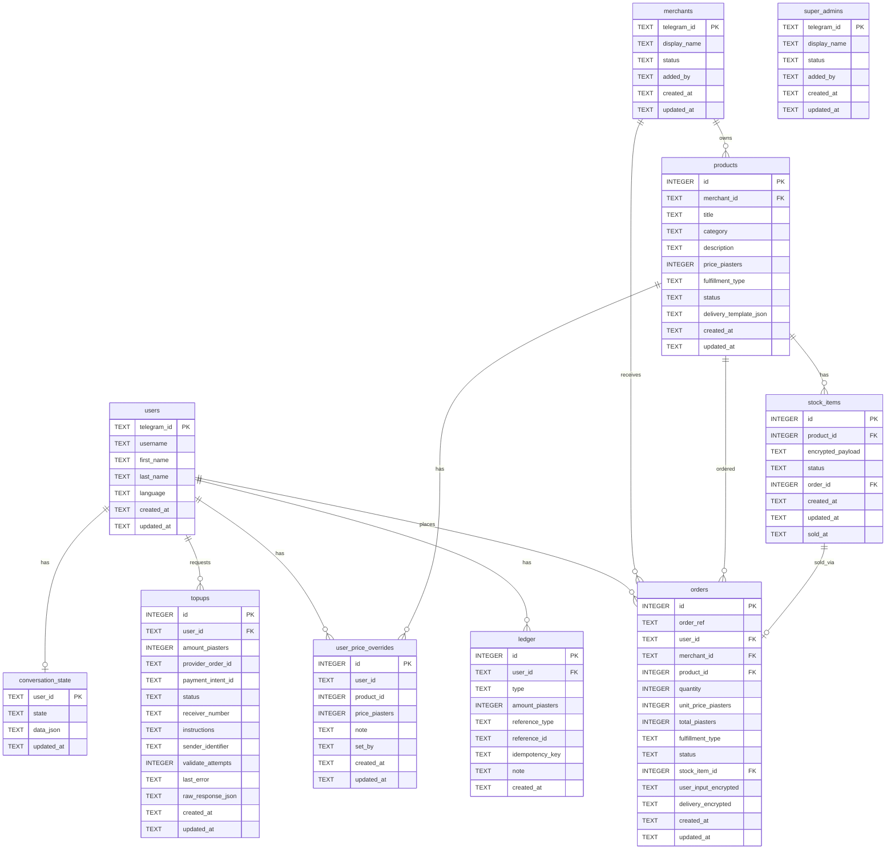
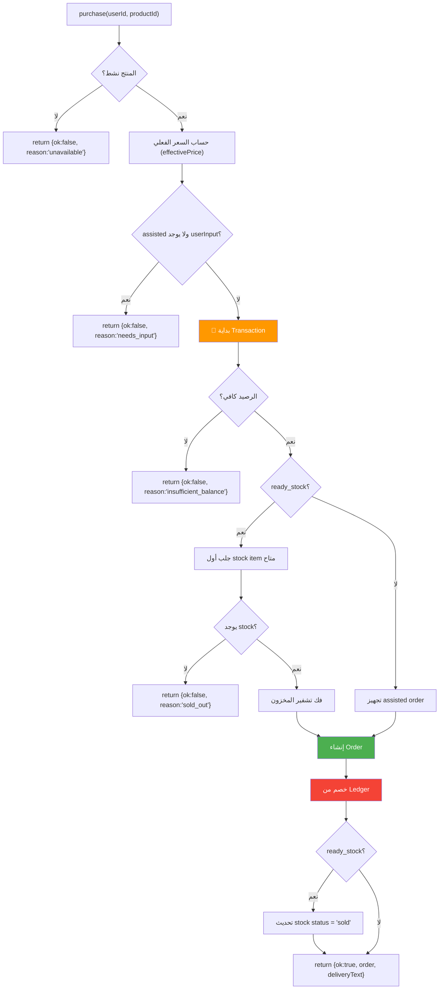
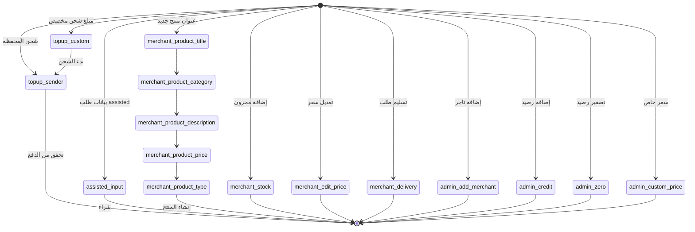
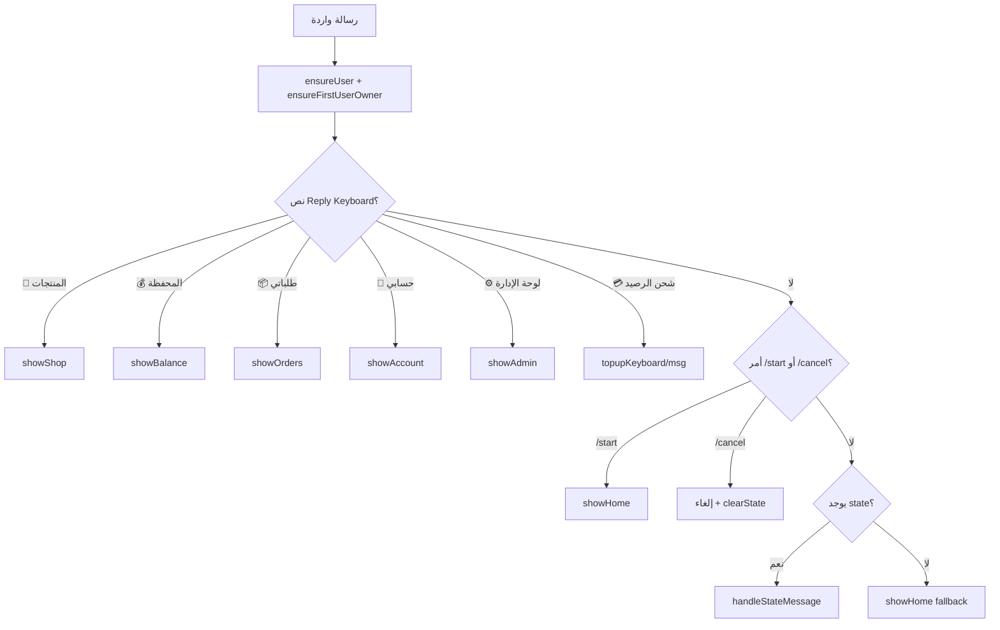
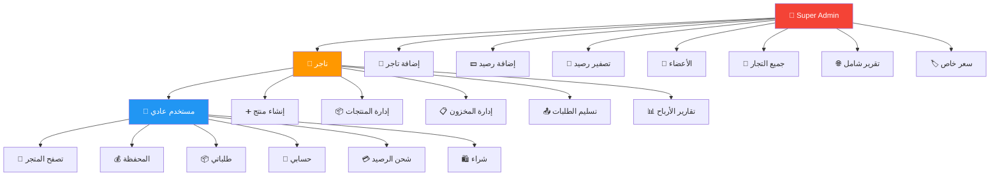
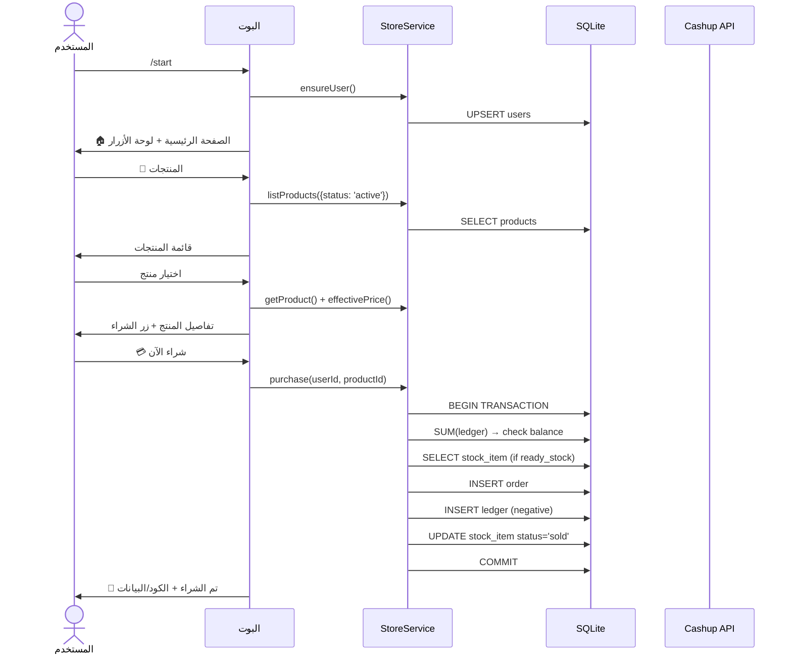

# 🏪 AI Studio Store Bot — تحليل شامل للمشروع بالكامل

> بوت تليجرام لبيع المنتجات الرقمية مع دعم التسليم الفوري والتسليم بمساعدة البائع، محفظة إلكترونية، وإدارة تجار/أدمنز.

---

## 📁 هيكل المشروع

```
minof-ai-studio-store-clean/
├── .env                          ← متغيرات البيئة (التوكن، المفاتيح، الإعدادات)
├── .env.example                  ← نموذج متغيرات البيئة
├── .gitignore                    ← الملفات المستثناة من Git
├── package.json                  ← بيانات المشروع والاعتماديات
├── README.md                     ← وثيقة البدء السريع
├── DEVELOPER_RUNBOOK.md          ← دليل المطور الشامل
├── bin/
│   ├── minof-ai-studio-bot.js    ← نقطة الدخول الرئيسية (Entry Point)
│   └── seed-sample.js            ← سكريبت البيانات التجريبية
├── src/
│   ├── bot.js                    ← منطق البوت الرئيسي (819 سطر)
│   ├── StoreService.js           ← طبقة الأعمال/Business Logic (686 سطر)
│   ├── StoreDatabase.js          ← إنشاء وترحيل قاعدة البيانات (180 سطر)
│   ├── TelegramApi.js            ← واجهة Telegram Bot API (171 سطر)
│   ├── SecretBox.js              ← تشفير AES-256-GCM (40 سطر)
│   └── CashupClient.js           ← عميل خدمة الدفع Cashup (66 سطر)
├── deploy/
│   └── systemd/
│       └── minof-ai-studio-store-bot.service  ← ملف خدمة systemd
└── runtime/
    └── store.db                  ← قاعدة بيانات SQLite
```

---

## 🔗 مخطط العلاقات بين الملفات



---

## 📦 الاعتماديات (Dependencies)

| الحزمة | الإصدار | الغرض |
|--------|---------|-------|
| `better-sqlite3` | `^12.10.0` | قاعدة بيانات SQLite متزامنة عالية الأداء |
| `dotenv` | `^17.4.2` | تحميل متغيرات البيئة من `.env` |
| `node-fetch` | `^2.7.0` | HTTP client (CommonJS compatible) |

---

## 📄 تحليل كل ملف بالتفصيل

---

### 1️⃣ [minof-ai-studio-bot.js](file:///c:/DEV/TEST/minof-ai-studio-store-clean/bin/minof-ai-studio-bot.js) — نقطة الدخول

هذا هو الملف الذي يُشغّل البوت. يقوم بتهيئة كل المكونات وربطها ببعض.

#### الدوال:

| الدالة | السطر | الوصف |
|--------|-------|-------|
| [idSet(value)](file:///c:/DEV/TEST/minof-ai-studio-store-clean/bin/minof-ai-studio-bot.js#L13-L15) | 13-15 | تحويل نص مفصول بفواصل إلى `Set` — يُستخدم لتحويل `SUPER_ADMIN_IDS` من نص لمجموعة |
| [main()](file:///c:/DEV/TEST/minof-ai-studio-store-clean/bin/minof-ai-studio-bot.js#L17-L37) | 17-37 | الدالة الرئيسية: تهيئة كل المكونات وبدء polling |

#### تدفق `main()`:


---

### 2️⃣ [SecretBox.js](file:///c:/DEV/TEST/minof-ai-studio-store-clean/src/SecretBox.js) — التشفير

يستخدم **AES-256-GCM** لتشفير بيانات المخزون والطلبات الحساسة.

#### الدوال:

| الدالة | السطر | الوصف |
|--------|-------|-------|
| [keyFromValue(value)](file:///c:/DEV/TEST/minof-ai-studio-store-clean/src/SecretBox.js#L5-L11) | 5-11 | تحويل المفتاح من hex (64 حرف) أو نص عادي (يُحوّل بـ SHA-256) إلى Buffer 32 بايت |
| [SecretBox.constructor(secret)](file:///c:/DEV/TEST/minof-ai-studio-store-clean/src/SecretBox.js#L14-L16) | 14-16 | تهيئة الكلاس بمفتاح التشفير |
| [SecretBox.encrypt(value)](file:///c:/DEV/TEST/minof-ai-studio-store-clean/src/SecretBox.js#L18-L24) | 18-24 | تشفير النص → `v1:iv_base64:tag_base64:ciphertext_base64` |
| [SecretBox.decrypt(payload)](file:///c:/DEV/TEST/minof-ai-studio-store-clean/src/SecretBox.js#L26-L36) | 26-36 | فك التشفير من التنسيق أعلاه → النص الأصلي |

#### تفاصيل التشفير:
- **خوارزمية**: AES-256-GCM (Authenticated Encryption)
- **IV**: 12 بايت عشوائي لكل عملية تشفير
- **Auth Tag**: 16 بايت للتحقق من سلامة البيانات
- **التنسيق**: `v1:{IV}:{AuthTag}:{Ciphertext}` — الكل Base64

---

### 3️⃣ [CashupClient.js](file:///c:/DEV/TEST/minof-ai-studio-store-clean/src/CashupClient.js) — عميل الدفع

عميل HTTP للتواصل مع خدمة Cashup لشحن المحفظة.

#### الدوال:

| الدالة | السطر | الوصف |
|--------|-------|-------|
| [trimTrailingSlash(value)](file:///c:/DEV/TEST/minof-ai-studio-store-clean/src/CashupClient.js#L5-L7) | 5-7 | إزالة `/` الزائدة من نهاية URL |
| [CashupClient.constructor(options)](file:///c:/DEV/TEST/minof-ai-studio-store-clean/src/CashupClient.js#L10-L16) | 10-16 | تهيئة: enabled, baseUrl, credential, appId من الخيارات أو env |
| [CashupClient.assertReady()](file:///c:/DEV/TEST/minof-ai-studio-store-clean/src/CashupClient.js#L18-L23) | 18-23 | التحقق أن الخدمة مفعلة وبيانات الاعتماد موجودة |
| [CashupClient.postJson(url, body)](file:///c:/DEV/TEST/minof-ai-studio-store-clean/src/CashupClient.js#L25-L46) | 25-46 | إرسال POST request مع Bearer auth ومعالجة الاستجابة |
| [CashupClient.createPaymentIntent({...})](file:///c:/DEV/TEST/minof-ai-studio-store-clean/src/CashupClient.js#L48-L55) | 48-55 | إنشاء طلب دفع جديد (payment intent) |
| [CashupClient.validatePaymentIntent(id, sender)](file:///c:/DEV/TEST/minof-ai-studio-store-clean/src/CashupClient.js#L57-L62) | 57-62 | التحقق من صحة الدفع عبر معرف المرسل |

#### API Endpoints:
```
POST /api/v1/transactions/{appId}/payment_intents    → إنشاء طلب دفع
POST /api/v1/transactions/payment_intents/{id}/validate → التحقق من الدفع
```

---

### 4️⃣ [TelegramApi.js](file:///c:/DEV/TEST/minof-ai-studio-store-clean/src/TelegramApi.js) — واجهة تليجرام

طبقة التواصل مع Telegram Bot API مع rate limiting وretry logic.

#### الدوال المساعدة:

| الدالة | السطر | الوصف |
|--------|-------|-------|
| [sleep(ms)](file:///c:/DEV/TEST/minof-ai-studio-store-clean/src/TelegramApi.js#L7) | 7 | Promise-based delay |
| [timeoutMs(method, payload)](file:///c:/DEV/TEST/minof-ai-studio-store-clean/src/TelegramApi.js#L9-L15) | 9-15 | حساب timeout مناسب لكل method (getUpdates أطول) |
| [fetchWithTimeout(url, options, ms)](file:///c:/DEV/TEST/minof-ai-studio-store-clean/src/TelegramApi.js#L17-L25) | 17-25 | HTTP fetch مع AbortController timeout |
| [multipartBody(fields, files)](file:///c:/DEV/TEST/minof-ai-studio-store-clean/src/TelegramApi.js#L27-L48) | 27-48 | بناء multipart/form-data يدوياً لرفع الملفات |

#### كلاس TelegramApi:

| الميثود | السطر | الوصف |
|---------|-------|-------|
| [constructor(token)](file:///c:/DEV/TEST/minof-ai-studio-store-clean/src/TelegramApi.js#L51-L58) | 51-58 | تهيئة مع token + maps لـ rate limiting |
| [_cleanupRateLimitMaps(now)](file:///c:/DEV/TEST/minof-ai-studio-store-clean/src/TelegramApi.js#L60-L72) | 60-72 | تنظيف maps القديمة (أكثر من 1000 عنصر) |
| [_pace(chatId)](file:///c:/DEV/TEST/minof-ai-studio-store-clean/src/TelegramApi.js#L74-L84) | 74-84 | تنظيم سرعة الإرسال لكل chat (200ms minimum gap) |
| [request(method, payload, options)](file:///c:/DEV/TEST/minof-ai-studio-store-clean/src/TelegramApi.js#L86-L120) | 86-120 | الطلب الأساسي مع retry + rate limit handling (429) |
| [requestMultipart(method, fields, files)](file:///c:/DEV/TEST/minof-ai-studio-store-clean/src/TelegramApi.js#L122-L133) | 122-133 | طلب multipart لرفع الملفات |
| [getUpdates(offset, timeout)](file:///c:/DEV/TEST/minof-ai-studio-store-clean/src/TelegramApi.js#L135-L141) | 135-141 | Long polling للتحديثات الجديدة |
| [sendMessage(chatId, text, options)](file:///c:/DEV/TEST/minof-ai-studio-store-clean/src/TelegramApi.js#L143-L150) | 143-150 | إرسال رسالة نصية |
| [editMessageText(chatId, messageId, text)](file:///c:/DEV/TEST/minof-ai-studio-store-clean/src/TelegramApi.js#L152-L160) | 152-160 | تعديل رسالة موجودة |
| [answerCallbackQuery(id, options)](file:///c:/DEV/TEST/minof-ai-studio-store-clean/src/TelegramApi.js#L162-L167) | 162-167 | الرد على callback query |

#### Rate Limiting Strategy:
- **Per-chat gap**: 200ms minimum بين كل رسالتين لنفس الشات
- **429 handling**: انتظار `retry_after` + 250ms
- **Retry**: حتى 2 محاولات (قابل للتعديل)
- **500 errors**: إعادة محاولة مع backoff
- **Map cleanup**: تنظيف تلقائي عند تجاوز 1000 عنصر

---

### 5️⃣ [StoreDatabase.js](file:///c:/DEV/TEST/minof-ai-studio-store-clean/src/StoreDatabase.js) — قاعدة البيانات

إنشاء وإدارة قاعدة بيانات SQLite مع migrations.

#### الدوال:

| الدالة | السطر | الوصف |
|--------|-------|-------|
| [resolveDbPath(filePath)](file:///c:/DEV/TEST/minof-ai-studio-store-clean/src/StoreDatabase.js#L10-L13) | 10-13 | تحويل المسار النسبي لمسار مطلق |
| [openStoreDatabase(filePath)](file:///c:/DEV/TEST/minof-ai-studio-store-clean/src/StoreDatabase.js#L15-L23) | 15-23 | فتح قاعدة البيانات + WAL mode + migrations |
| [columnExists(db, table, column)](file:///c:/DEV/TEST/minof-ai-studio-store-clean/src/StoreDatabase.js#L25-L27) | 25-27 | التحقق من وجود عمود في جدول |
| [migrate(db)](file:///c:/DEV/TEST/minof-ai-studio-store-clean/src/StoreDatabase.js#L29-L173) | 29-173 | إنشاء كل الجداول والفهارس |

#### مخطط قاعدة البيانات (9 جداول):



#### الفهارس (Indexes):
| الفهرس | الأعمدة |
|--------|---------|
| `idx_products_merchant` | `products(merchant_id)` |
| `idx_products_status` | `products(status)` |
| `idx_stock_product_status` | `stock_items(product_id, status)` |
| `idx_orders_user` | `orders(user_id, created_at)` |
| `idx_orders_merchant` | `orders(merchant_id, created_at)` |
| `idx_topups_user_status` | `topups(user_id, status)` |
| `idx_ledger_user` | `ledger(user_id, created_at)` |
| `idx_price_overrides_user` | `user_price_overrides(user_id)` |
| `idx_price_overrides_product` | `user_price_overrides(product_id)` |

---

### 6️⃣ [StoreService.js](file:///c:/DEV/TEST/minof-ai-studio-store-clean/src/StoreService.js) — طبقة الأعمال

أكبر ملف بعد bot.js — يحتوي كل العمليات التجارية.

#### الثوابت:
| الثابت | القيمة | الوصف |
|--------|--------|-------|
| `FULFILLMENT_TYPES` | `ready_stock`, `assisted` | أنواع التسليم المدعومة |
| `MIN_TOPUP_PIASTERS` | `1000` (10 EGP) | أقل مبلغ شحن |
| `MAX_TOPUP_PIASTERS` | `500000` (5000 EGP) | أقصى مبلغ شحن |

#### الدوال المساعدة (Utility):

| الدالة | السطر | الوصف |
|--------|-------|-------|
| [nowIso()](file:///c:/DEV/TEST/minof-ai-studio-store-clean/src/StoreService.js#L9-L11) | 9-11 | التوقيت الحالي بتنسيق ISO |
| [cleanText(value, maxLength)](file:///c:/DEV/TEST/minof-ai-studio-store-clean/src/StoreService.js#L13-L15) | 13-15 | تنظيف وتقليم النص |
| [parseJson(value, fallback)](file:///c:/DEV/TEST/minof-ai-studio-store-clean/src/StoreService.js#L17-L23) | 17-23 | JSON parse آمن مع fallback |
| [json(value)](file:///c:/DEV/TEST/minof-ai-studio-store-clean/src/StoreService.js#L25-L27) | 25-27 | JSON stringify آمن |
| [safeTelegramId(value, label)](file:///c:/DEV/TEST/minof-ai-studio-store-clean/src/StoreService.js#L29-L33) | 29-33 | التحقق من أن ID رقمي صحيح |
| [orderRef(prefix)](file:///c:/DEV/TEST/minof-ai-studio-store-clean/src/StoreService.js#L35-L37) | 35-37 | توليد reference فريد: `ORD-BASE36-HEXRAND` |
| [assertPositivePiasters(value, label)](file:///c:/DEV/TEST/minof-ai-studio-store-clean/src/StoreService.js#L39-L43) | 39-43 | التحقق أن المبلغ عدد صحيح موجب |
| [assertTopupAmount(amount)](file:///c:/DEV/TEST/minof-ai-studio-store-clean/src/StoreService.js#L45-L52) | 45-52 | التحقق من حدود مبلغ الشحن |

#### كلاس StoreService — كل الميثودز:

##### إدارة المستخدمين (Users)

| الميثود | السطر | الوصف |
|---------|-------|-------|
| [constructor(options)](file:///c:/DEV/TEST/minof-ai-studio-store-clean/src/StoreService.js#L55-L61) | 55-61 | تهيئة بـ `db`, `secretBox`, `cashupClient` |
| [ensureUser(from)](file:///c:/DEV/TEST/minof-ai-studio-store-clean/src/StoreService.js#L63-L83) | 63-83 | إنشاء أو تحديث مستخدم (UPSERT) → يرجع `telegram_id` |
| [getUser(userId)](file:///c:/DEV/TEST/minof-ai-studio-store-clean/src/StoreService.js#L85-L87) | 85-87 | جلب بيانات مستخدم |
| [getUserLanguage(userId)](file:///c:/DEV/TEST/minof-ai-studio-store-clean/src/StoreService.js#L89-L91) | 89-91 | جلب لغة المستخدم (افتراضي: `ar`) |
| [setUserLanguage(userId, lang)](file:///c:/DEV/TEST/minof-ai-studio-store-clean/src/StoreService.js#L93-L98) | 93-98 | تعيين لغة المستخدم (`ar` أو `en`) |
| [firstUser()](file:///c:/DEV/TEST/minof-ai-studio-store-clean/src/StoreService.js#L100-L102) | 100-102 | جلب أول مستخدم مسجل |
| [ensureFirstUserOwner()](file:///c:/DEV/TEST/minof-ai-studio-store-clean/src/StoreService.js#L104-L113) | 104-113 | جعل أول مستخدم super admin تلقائياً |
| [resolveUserId(input)](file:///c:/DEV/TEST/minof-ai-studio-store-clean/src/StoreService.js#L196-L205) | 196-205 | تحويل ID أو @username لـ telegram_id |
| [countUsers()](file:///c:/DEV/TEST/minof-ai-studio-store-clean/src/StoreService.js#L207-L209) | 207-209 | عدد المستخدمين الكلي |
| [listUsers(limit, offset)](file:///c:/DEV/TEST/minof-ai-studio-store-clean/src/StoreService.js#L211-L218) | 211-218 | قائمة المستخدمين مع pagination |

##### إدارة التجار (Merchants)

| الميثود | السطر | الوصف |
|---------|-------|-------|
| [ensureMerchant(telegramId, options)](file:///c:/DEV/TEST/minof-ai-studio-store-clean/src/StoreService.js#L115-L134) | 115-134 | إنشاء/تحديث تاجر (UPSERT) |
| [getMerchant(telegramId)](file:///c:/DEV/TEST/minof-ai-studio-store-clean/src/StoreService.js#L136-L138) | 136-138 | جلب بيانات تاجر |
| [isActiveMerchant(telegramId)](file:///c:/DEV/TEST/minof-ai-studio-store-clean/src/StoreService.js#L140-L142) | 140-142 | هل التاجر نشط؟ |
| [listMerchants()](file:///c:/DEV/TEST/minof-ai-studio-store-clean/src/StoreService.js#L144-L156) | 144-156 | قائمة التجار مع إحصائيات JOIN |

##### إدارة الأدمنز (Super Admins)

| الميثود | السطر | الوصف |
|---------|-------|-------|
| [ensureSuperAdmin(telegramId, options)](file:///c:/DEV/TEST/minof-ai-studio-store-clean/src/StoreService.js#L158-L182) | 158-182 | إنشاء super admin + تاجر تلقائياً |
| [getSuperAdmin(telegramId)](file:///c:/DEV/TEST/minof-ai-studio-store-clean/src/StoreService.js#L184-L186) | 184-186 | جلب بيانات أدمن |
| [isSuperAdmin(telegramId)](file:///c:/DEV/TEST/minof-ai-studio-store-clean/src/StoreService.js#L188-L190) | 188-190 | هل هو super admin نشط؟ |
| [listSuperAdmins()](file:///c:/DEV/TEST/minof-ai-studio-store-clean/src/StoreService.js#L192-L194) | 192-194 | قائمة كل الأدمنز |

##### المحفظة والسجل المالي (Wallet & Ledger)

| الميثود | السطر | الوصف |
|---------|-------|-------|
| [balance(userId)](file:///c:/DEV/TEST/minof-ai-studio-store-clean/src/StoreService.js#L220-L224) | 220-224 | حساب الرصيد: `SUM(amount_piasters)` |
| [ledger(userId, limit)](file:///c:/DEV/TEST/minof-ai-studio-store-clean/src/StoreService.js#L226-L233) | 226-233 | آخر عمليات المحفظة |
| [adminCreditUser(adminId, userId, amount, note)](file:///c:/DEV/TEST/minof-ai-studio-store-clean/src/StoreService.js#L235-L246) | 235-246 | إضافة رصيد يدوي من الأدمن |
| [adminZeroBalance(adminId, userId)](file:///c:/DEV/TEST/minof-ai-studio-store-clean/src/StoreService.js#L248-L259) | 248-259 | تصفير رصيد مستخدم |

> [!IMPORTANT]
> الرصيد يُحسب كمجموع `ledger.amount_piasters` — لا يوجد عمود balance مباشر. هذا أكثر أماناً لأنه يمنع تناقض البيانات.

##### حالة المحادثة (Conversation State)

| الميثود | السطر | الوصف |
|---------|-------|-------|
| [getState(userId)](file:///c:/DEV/TEST/minof-ai-studio-store-clean/src/StoreService.js#L261-L265) | 261-265 | جلب حالة المحادثة الحالية |
| [setState(userId, state, data)](file:///c:/DEV/TEST/minof-ai-studio-store-clean/src/StoreService.js#L267-L277) | 267-277 | تعيين حالة جديدة (UPSERT) |
| [clearState(userId)](file:///c:/DEV/TEST/minof-ai-studio-store-clean/src/StoreService.js#L279-L281) | 279-281 | مسح الحالة |

##### شحن المحفظة (Top-ups)

| الميثود | السطر | الوصف |
|---------|-------|-------|
| [createTopup(userId, amount)](file:///c:/DEV/TEST/minof-ai-studio-store-clean/src/StoreService.js#L283-L314) | 283-314 | إنشاء طلب شحن عبر Cashup API |
| [getTopup(topupId)](file:///c:/DEV/TEST/minof-ai-studio-store-clean/src/StoreService.js#L316-L318) | 316-318 | جلب بيانات طلب شحن |
| [validateTopup(userId, topupId, sender)](file:///c:/DEV/TEST/minof-ai-studio-store-clean/src/StoreService.js#L320-L371) | 320-371 | التحقق من الدفع وإضافة الرصيد (مع transaction) |

##### إدارة المنتجات (Products)

| الميثود | السطر | الوصف |
|---------|-------|-------|
| [createProduct(merchantId, input)](file:///c:/DEV/TEST/minof-ai-studio-store-clean/src/StoreService.js#L373-L401) | 373-401 | إنشاء منتج جديد |
| [getProduct(productId)](file:///c:/DEV/TEST/minof-ai-studio-store-clean/src/StoreService.js#L403-L412) | 403-412 | جلب منتج مع `available_stock` count |
| [listProducts(options)](file:///c:/DEV/TEST/minof-ai-studio-store-clean/src/StoreService.js#L414-L427) | 414-427 | قائمة المنتجات مع فلتر الحالة |
| [listMerchantProducts(merchantId)](file:///c:/DEV/TEST/minof-ai-studio-store-clean/src/StoreService.js#L429-L437) | 429-437 | منتجات تاجر محدد |
| [setProductStatus(merchantId, productId, status)](file:///c:/DEV/TEST/minof-ai-studio-store-clean/src/StoreService.js#L439-L446) | 439-446 | تغيير حالة: active/paused/draft |
| [updateProductPrice(merchantId, productId, price)](file:///c:/DEV/TEST/minof-ai-studio-store-clean/src/StoreService.js#L448-L455) | 448-455 | تحديث سعر المنتج |

##### إدارة المخزون (Stock)

| الميثود | السطر | الوصف |
|---------|-------|-------|
| [addStock(merchantId, productId, items)](file:///c:/DEV/TEST/minof-ai-studio-store-clean/src/StoreService.js#L457-L475) | 457-475 | إضافة عناصر مخزون مشفرة (transaction) |
| [clearAvailableStock(merchantId, productId)](file:///c:/DEV/TEST/minof-ai-studio-store-clean/src/StoreService.js#L477-L483) | 477-483 | حذف كل المخزون المتاح |

##### أسعار مخصصة (Price Overrides)

| الميثود | السطر | الوصف |
|---------|-------|-------|
| [getUserPriceOverride(userId, productId)](file:///c:/DEV/TEST/minof-ai-studio-store-clean/src/StoreService.js#L485-L488) | 485-488 | جلب سعر مخصص لمستخدم/منتج |
| [setUserPriceOverride(adminId, userId, productId, price, note)](file:///c:/DEV/TEST/minof-ai-studio-store-clean/src/StoreService.js#L490-L508) | 490-508 | تعيين سعر خاص (UPSERT) |
| [effectivePrice(userId, product)](file:///c:/DEV/TEST/minof-ai-studio-store-clean/src/StoreService.js#L510-L513) | 510-513 | السعر الفعلي (override أو الأصلي) |

##### الشراء والطلبات (Purchase & Orders)

| الميثود | السطر | الوصف |
|---------|-------|-------|
| [purchase(userId, productId, options)](file:///c:/DEV/TEST/minof-ai-studio-store-clean/src/StoreService.js#L515-L594) | 515-594 | **عملية الشراء الكاملة** (Transaction) |
| [getOrder(orderId)](file:///c:/DEV/TEST/minof-ai-studio-store-clean/src/StoreService.js#L596-L609) | 596-609 | جلب طلب مع فك تشفير البيانات |
| [listUserPurchaseHistory(userId, limit)](file:///c:/DEV/TEST/minof-ai-studio-store-clean/src/StoreService.js#L611-L621) | 611-621 | سجل مشتريات المستخدم |
| [listMerchantOrders(merchantId, options)](file:///c:/DEV/TEST/minof-ai-studio-store-clean/src/StoreService.js#L623-L636) | 623-636 | طلبات التاجر مع فلتر الحالة |
| [deliverOrder(merchantId, orderId, deliveryText)](file:///c:/DEV/TEST/minof-ai-studio-store-clean/src/StoreService.js#L638-L652) | 638-652 | تسليم طلب assisted |

##### التقارير (Reports)

| الميثود | السطر | الوصف |
|---------|-------|-------|
| [merchantStats(merchantId)](file:///c:/DEV/TEST/minof-ai-studio-store-clean/src/StoreService.js#L654-L663) | 654-663 | إحصائيات تاجر (منتجات، طلبات، إيرادات) |
| [platformStats()](file:///c:/DEV/TEST/minof-ai-studio-store-clean/src/StoreService.js#L665-L674) | 665-674 | إحصائيات المنصة الشاملة |

#### تدفق عملية الشراء `purchase()`:



---

### 7️⃣ [bot.js](file:///c:/DEV/TEST/minof-ai-studio-store-clean/src/bot.js) — منطق البوت الرئيسي

أكبر ملف (819 سطر) — يحتوي كل منطق التفاعل مع المستخدم.

#### الدوال المساعدة:

| الدالة | السطر | الوصف |
|--------|-------|-------|
| [brandName()](file:///c:/DEV/TEST/minof-ai-studio-store-clean/src/bot.js#L5-L7) | 5-7 | اسم المتجر من env |
| [currencyCode()](file:///c:/DEV/TEST/minof-ai-studio-store-clean/src/bot.js#L9-L11) | 9-11 | رمز العملة (EGP) |
| [formatMoney(piasters)](file:///c:/DEV/TEST/minof-ai-studio-store-clean/src/bot.js#L13-L20) | 13-20 | تنسيق المبلغ: `piasters → "50 EGP"` أو `"50.25 EGP"` |
| [parseMoneyToPiasters(value)](file:///c:/DEV/TEST/minof-ai-studio-store-clean/src/bot.js#L22-L27) | 22-27 | تحويل: `"50"` أو `"50.25"` → piasters |
| [topupsEnabled()](file:///c:/DEV/TEST/minof-ai-studio-store-clean/src/bot.js#L29-L31) | 29-31 | هل الشحن التلقائي مفعل؟ |
| [isCommand(text, command)](file:///c:/DEV/TEST/minof-ai-studio-store-clean/src/bot.js#L33-L37) | 33-37 | هل الرسالة أمر تليجرام `/command`؟ |
| [panel(title, lines)](file:///c:/DEV/TEST/minof-ai-studio-store-clean/src/bot.js#L39-L41) | 39-41 | بناء رسالة منسقة بعنوان وخطوط |
| [displayName(user)](file:///c:/DEV/TEST/minof-ai-studio-store-clean/src/bot.js#L43-L48) | 43-48 | اسم العرض للمستخدم |
| [staffStatus(store, superAdmins, userId)](file:///c:/DEV/TEST/minof-ai-studio-store-clean/src/bot.js#L50-L56) | 50-56 | فحص صلاحيات المستخدم (admin/merchant) |

#### دوال بناء لوحات المفاتيح (Keyboards):

| الدالة | السطر | الوصف |
|--------|-------|-------|
| [replyMenuKeyboard(isStaff)](file:///c:/DEV/TEST/minof-ai-studio-store-clean/src/bot.js#L58-L70) | 58-70 | لوحة أزرار ثابتة أسفل الشات |
| [homeKeyboard(isStaff)](file:///c:/DEV/TEST/minof-ai-studio-store-clean/src/bot.js#L72-L74) | 72-74 | أزرار inline للصفحة الرئيسية |
| [adminKeyboard(isSuperAdmin)](file:///c:/DEV/TEST/minof-ai-studio-store-clean/src/bot.js#L76-L89) | 76-89 | لوحة الإدارة (تجار + super admin) |
| [productTypeKeyboard()](file:///c:/DEV/TEST/minof-ai-studio-store-clean/src/bot.js#L91-L97) | 91-97 | اختيار نوع التسليم |
| [productListKeyboard(products)](file:///c:/DEV/TEST/minof-ai-studio-store-clean/src/bot.js#L99-L114) | 99-114 | قائمة المنتجات مع badges المخزون |
| [productActions(product, isAvailable)](file:///c:/DEV/TEST/minof-ai-studio-store-clean/src/bot.js#L116-L124) | 116-124 | أزرار المنتج (شراء + عودة) |
| [merchantProductKeyboard(product)](file:///c:/DEV/TEST/minof-ai-studio-store-clean/src/bot.js#L126-L136) | 126-136 | أزرار إدارة المنتج للتاجر |
| [topupKeyboard()](file:///c:/DEV/TEST/minof-ai-studio-store-clean/src/bot.js#L138-L145) | 138-145 | أزرار مبالغ الشحن |

#### دوال العرض (Show Functions):

| الدالة | السطر | الوصف |
|--------|-------|-------|
| [homeText(store, userId)](file:///c:/DEV/TEST/minof-ai-studio-store-clean/src/bot.js#L147-L155) | 147-155 | نص الصفحة الرئيسية |
| [productText(store, userId, product)](file:///c:/DEV/TEST/minof-ai-studio-store-clean/src/bot.js#L157-L178) | 157-178 | نص تفاصيل المنتج |
| [safeEditOrSend(api, chatId, messageId, text, options)](file:///c:/DEV/TEST/minof-ai-studio-store-clean/src/bot.js#L180-L187) | 180-187 | تعديل رسالة أو إرسال جديدة (fallback آمن) |
| [showHome(api, store, superAdmins, chatId, from, messageId)](file:///c:/DEV/TEST/minof-ai-studio-store-clean/src/bot.js#L189-L203) | 189-203 | عرض الصفحة الرئيسية + reply keyboard |
| [showShop(api, store, chatId, messageId)](file:///c:/DEV/TEST/minof-ai-studio-store-clean/src/bot.js#L205-L211) | 205-211 | عرض المتجر وقائمة المنتجات |
| [showBalance(api, store, chatId, userId, messageId)](file:///c:/DEV/TEST/minof-ai-studio-store-clean/src/bot.js#L213-L224) | 213-224 | عرض المحفظة وآخر العمليات |
| [showOrders(api, store, chatId, userId, messageId)](file:///c:/DEV/TEST/minof-ai-studio-store-clean/src/bot.js#L226-L234) | 226-234 | عرض سجل الطلبات |
| [showAccount(api, store, chatId, userId, from, messageId)](file:///c:/DEV/TEST/minof-ai-studio-store-clean/src/bot.js#L236-L247) | 236-247 | عرض بيانات الحساب |
| [showAdmin(api, store, superAdmins, chatId, userId, messageId)](file:///c:/DEV/TEST/minof-ai-studio-store-clean/src/bot.js#L249-L262) | 249-262 | عرض لوحة الإدارة |

#### دوال الإشعارات والشراء:

| الدالة | السطر | الوصف |
|--------|-------|-------|
| [notifyStaffAboutAssistedOrder(api, store, superAdmins, result)](file:///c:/DEV/TEST/minof-ai-studio-store-clean/src/bot.js#L264-L278) | 264-278 | إشعار التاجر والأدمنز بطلب جديد |
| [handlePurchaseResult(api, store, superAdmins, chatId, userId, result)](file:///c:/DEV/TEST/minof-ai-studio-store-clean/src/bot.js#L280-L316) | 280-316 | معالجة نتيجة الشراء (نجاح/فشل) |
| [startTopup(api, store, chatId, userId, amount)](file:///c:/DEV/TEST/minof-ai-studio-store-clean/src/bot.js#L318-L334) | 318-334 | بدء عملية شحن المحفظة |

#### معالجة حالات المحادثة [handleStateMessage()](file:///c:/DEV/TEST/minof-ai-studio-store-clean/src/bot.js#L336-L476):



| الحالة (State) | السطر | الوصف |
|----------------|-------|-------|
| `topup_sender` | 340-353 | انتظار اسم/رقم المرسل للتحقق من الدفع |
| `topup_custom` | 355-360 | انتظار مبلغ شحن مخصص |
| `assisted_input` | 362-367 | انتظار بيانات/متطلبات المشتري |
| `merchant_product_title` | 371-375 | عنوان المنتج الجديد → الخطوة التالية |
| `merchant_product_category` | 376-380 | تصنيف المنتج → الخطوة التالية |
| `merchant_product_description` | 381-385 | وصف المنتج → الخطوة التالية |
| `merchant_product_price` | 386-391 | سعر المنتج → اختيار نوع التسليم |
| `merchant_stock` | 393-404 | استقبال عناصر المخزون (كل سطر = عنصر) |
| `merchant_edit_price` | 406-414 | تعديل سعر المنتج |
| `merchant_delivery` | 416-428 | تسليم طلب assisted + إشعار المشتري |
| `admin_add_merchant` | 432-440 | إضافة تاجر جديد (ID + اسم) |
| `admin_credit` | 442-450 | إضافة رصيد (ID + مبلغ + ملاحظة) |
| `admin_zero` | 452-459 | تصفير رصيد مستخدم |
| `admin_custom_price` | 461-473 | تعيين سعر خاص (ID + منتج + سعر + ملاحظة) |

#### [handleMessage()](file:///c:/DEV/TEST/minof-ai-studio-store-clean/src/bot.js#L478-L527) — معالجة الرسائل النصية:



#### [handleCallback()](file:///c:/DEV/TEST/minof-ai-studio-store-clean/src/bot.js#L529-L770) — معالجة أزرار Inline:

كل callback_data ومعالجتها:

| Callback Data | السطر | الوصف |
|--------------|-------|-------|
| `flow:cancel` | 539-543 | إلغاء العملية الحالية |
| `main:home` | 545-549 | عرض الصفحة الرئيسية |
| `main:shop` | 550 | عرض المتجر |
| `main:balance` | 551 | عرض المحفظة |
| `main:orders` | 552 | عرض الطلبات |
| `main:admin` | 553 | عرض لوحة الإدارة |
| `main:topup` | 555-562 | شحن المحفظة |
| `topup:{amount}` | 564-574 | بدء شحن بمبلغ محدد |
| `topup:custom` | 567-570 | شحن بمبلغ مخصص |
| `product:{id}` | 576-585 | عرض تفاصيل منتج |
| `buy:{id}` | 587-606 | شراء منتج (ready_stock فوري / assisted يطلب input) |
| `merchant:create_product` | 610-614 | بدء إنشاء منتج جديد |
| `merchant:wizard_type:{type}` | 615-635 | اختيار نوع التسليم وإنشاء المنتج |
| `merchant:products` | 637-644 | قائمة منتجات التاجر |
| `merchant:product:{id}` | 646-660 | تفاصيل منتج للإدارة |
| `merchant:add_stock:{id}` | 662-666 | بدء إضافة مخزون |
| `merchant:clear_stock:{id}` | 668-672 | مسح المخزون المتاح |
| `merchant:toggle:{id}` | 674-680 | تفعيل/إيقاف منتج |
| `merchant:edit_price:{id}` | 682-687 | بدء تعديل سعر |
| `merchant:orders` | 689-695 | الطلبات المعلقة |
| `merchant:deliver:{id}` | 697-702 | بدء تسليم طلب |
| `merchant:reports` | 704-713 | تقرير الأرباح |
| `admin:add_merchant` | 717-721 | إضافة تاجر (super admin فقط) |
| `admin:credit` | 723-727 | إضافة رصيد |
| `admin:zero` | 729-733 | تصفير رصيد |
| `admin:custom_price` | 735-739 | تعيين سعر خاص |
| `admin:members` | 741-747 | قائمة الأعضاء |
| `admin:merchants` | 749-757 | قائمة التجار |
| `admin:report` | 759-769 | تقرير المنصة الشامل |

#### نظام الطوابير [enqueueUpdate()](file:///c:/DEV/TEST/minof-ai-studio-store-clean/src/bot.js#L778-L785):

| الدالة | السطر | الوصف |
|--------|-------|-------|
| [queueKey(update)](file:///c:/DEV/TEST/minof-ai-studio-store-clean/src/bot.js#L772-L774) | 772-774 | مفتاح الطابور = chat_id |
| [enqueueUpdate(update, task)](file:///c:/DEV/TEST/minof-ai-studio-store-clean/src/bot.js#L778-L785) | 778-785 | تسلسل المعالجة لكل chat |
| [poll(api, store, superAdmins)](file:///c:/DEV/TEST/minof-ai-studio-store-clean/src/bot.js#L787-L812) | 787-812 | حلقة Long Polling الرئيسية |

> [!TIP]
> نظام الطوابير يضمن أن رسائل نفس الشات تُعالج بالترتيب (لمنع race conditions)، بينما رسائل شاتات مختلفة تُعالج بالتوازي.

---

### 8️⃣ [seed-sample.js](file:///c:/DEV/TEST/minof-ai-studio-store-clean/bin/seed-sample.js) — البيانات التجريبية

| الدالة | السطر | الوصف |
|--------|-------|-------|
| [firstAdminId()](file:///c:/DEV/TEST/minof-ai-studio-store-clean/bin/seed-sample.js#L11-L16) | 11-16 | أول admin ID من env |
| [main()](file:///c:/DEV/TEST/minof-ai-studio-store-clean/bin/seed-sample.js#L18-L59) | 18-59 | إنشاء بيانات تجريبية |

البيانات التجريبية:
1. **Sample Design Pack** — ready_stock بسعر 50 EGP مع 3 أكواد
2. **Sample Custom Work** — assisted بسعر 100 EGP
3. **رصيد 250 EGP** للأدمن

---

### 9️⃣ [minof-ai-studio-store-bot.service](file:///c:/DEV/TEST/minof-ai-studio-store-clean/deploy/systemd/minof-ai-studio-store-bot.service) — خدمة systemd

```ini
[Unit]
Description=AI Studio Store Telegram bot
After=network-online.target

[Service]
Type=simple
User=botuser
WorkingDirectory=/opt/ai-studio-store
ExecStart=/usr/bin/node bin/minof-ai-studio-bot.js
Restart=on-failure
RestartSec=5

[Install]
WantedBy=multi-user.target
```

---

## 🔐 نظام الصلاحيات



---

## 💰 نظام المحفظة (Ledger-Based)

| نوع العملية | المبلغ | المصدر |
|-------------|--------|--------|
| `admin_credit` | ➕ موجب | إضافة يدوية من الأدمن |
| `admin_zero` | ➖ سالب (= الرصيد الحالي) | تصفير |
| `topup` | ➕ موجب | شحن عبر Cashup |
| `purchase` | ➖ سالب | خصم شراء |

> الرصيد = `SUM(amount_piasters)` من جدول `ledger`

---

## 🔄 تدفق المستخدم الكامل



---

## 📊 متغيرات البيئة الكاملة

| المتغير | مطلوب | الافتراضي | الوصف |
|---------|-------|-----------|-------|
| `MINOF_AI_STUDIO_BOT_TOKEN` | ✅ | — | توكن بوت تليجرام |
| `MINOF_AI_STUDIO_SUPER_ADMIN_IDS` | ✅ | — | IDs الأدمنز (مفصولة بفاصلة) |
| `MINOF_AI_STUDIO_DATA_KEY` | ✅ | — | مفتاح التشفير (64 hex) |
| `MINOF_AI_STUDIO_DB_PATH` | ❌ | `runtime/store.db` | مسار قاعدة البيانات |
| `STORE_BRAND_NAME` | ❌ | `Mohamed Payment Store` | اسم المتجر |
| `STORE_CURRENCY_CODE` | ❌ | `EGP` | رمز العملة |
| `STORE_CURRENCY_NAME` | ❌ | `Egyptian pound` | اسم العملة |
| `TOPUPS_ENABLED` | ❌ | `0` | تفعيل الشحن التلقائي |
| `CASHUP_ENABLED` | ❌ | `false` | تفعيل Cashup |
| `CASHUP_BASE_URL` | ❌ | `https://cashup.cash/base` | عنوان API |
| `CASHUP_API_KEY` | ❌ | — | مفتاح API |
| `CASHUP_APP_ID` | ❌ | — | معرف التطبيق |
| `TELEGRAM_POLL_TIMEOUT` | ❌ | `25` | مدة Long Polling (ثواني) |
| `TG_REQUEST_TIMEOUT_MS` | ❌ | `10000` | timeout للطلبات العادية |
| `TG_MIN_PER_CHAT_GAP_MS` | ❌ | `200` | الحد الأدنى بين رسالتين لنفس الشات |
| `TG_REQUEST_MAX_ATTEMPTS` | ❌ | `2` | عدد محاولات إعادة الطلب |
| `TG_FILE_UPLOAD_TIMEOUT_MS` | ❌ | `120000` | timeout لرفع الملفات |

---

## ✅ المشروع مكتمل وجاهز للتشغيل

المشروع **مكتمل بالكامل** ولا يحتاج أي تعديلات لكي يعمل. إليك ملخص ما يفعله:

1. **بوت تليجرام** يعمل بـ Long Polling
2. **متجر رقمي** مع نوعين من المنتجات (فوري / بمساعدة)
3. **محفظة إلكترونية** قائمة على Ledger
4. **تشفير** AES-256-GCM لحماية المخزون والبيانات الحساسة
5. **لوحة إدارة** كاملة للتجار والأدمنز
6. **شحن رصيد** عبر Cashup (اختياري)
7. **أسعار مخصصة** لكل مستخدم
8. **نظام طوابير** لمنع race conditions
9. **Rate limiting** ذكي لتليجرام
10. **بيانات تجريبية** جاهزة للاختبار
